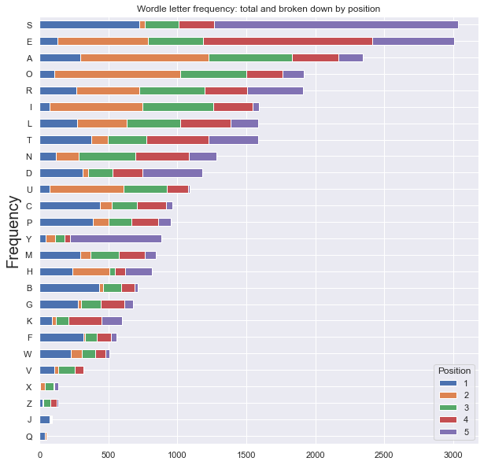
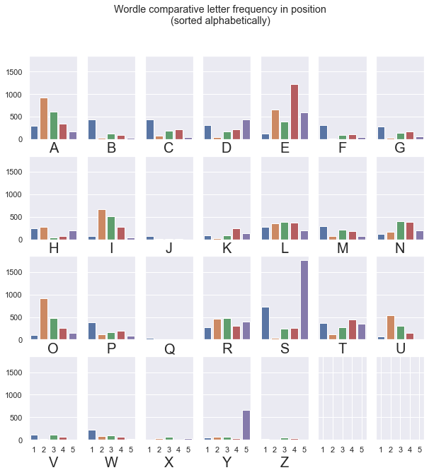
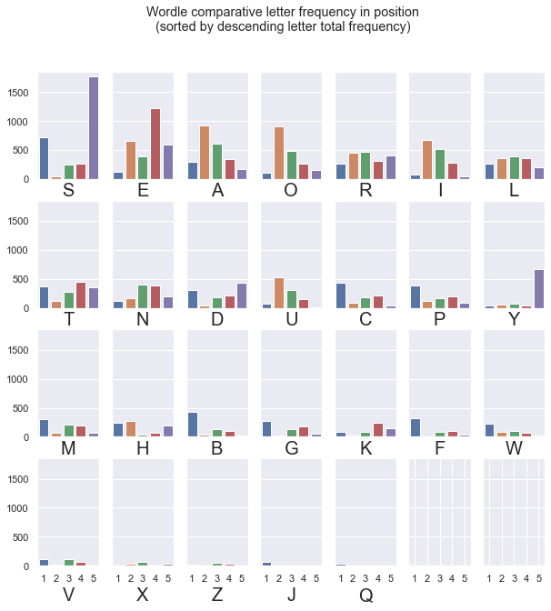

# Wordle Help
This is some fun letter/word stats to help solve the daily NYT Wordle puzzle: 
https://www.nytimes.com/games/wordle/index.html

Not cheating but aids on how to pick the right words/letters based on letter and word frequency

It uses a file containing the list of all 5-letter words (including plural of 4-letter words which might not be used based on this article: https://screenrant.com/wordle-answers-updated-word-puzzle-guide/) as its main source of data.
I don't know what the Wordle official word list is but so far all the words I have seen were in the list I'm using.

Based on the words in that list, I was able to determine the list of letter frequency.

## Easiest way to show the information
The easiest way to show the information is by bookmarking and running this jupyter notebook:
https://github.com/jeromegit/wordle/blob/main/wordle.ipynb 

### Letters sorted in alphabetical order
```
A: 2348
B: 715
C: 964
D: 1181
E: 3009
F: 561
G: 679
H: 814
I: 1592
J: 89
K: 596
L: 1586
M: 843
N: 1285
O: 1915
P: 955
Q: 53
R: 1910
S: 3033
T: 1585
U: 1089
V: 318
W: 505
X: 139
Y: 886
Z: 135
```

### Letters sorted by frequency
```
 1 S: 3033
 2 E: 3009
 3 A: 2348
 4 O: 1915
 5 R: 1910
 6 I: 1592
 7 L: 1586
 8 T: 1585
 9 N: 1285
10 D: 1181
11 U: 1089
12 C: 964
13 P: 955
14 Y: 886
15 M: 843
16 H: 814
17 B: 715
18 G: 679
19 K: 596
20 F: 561
21 W: 505
22 V: 318
23 X: 139
24 Z: 135
25 J: 89
26 Q: 53
```

### Top words with most frequent unrepeated letters
```
 1 arose: 12215
 2 raise: 11892
 3 arise: 11892
 4 aloes: 11891
 5 stoae: 11890
 6 laser: 11886
 7 earls: 11886
 8 reals: 11886
 9 tears: 11885
10 rates: 11885
11 stare: 11885
12 aster: 11885
13 tares: 11885
14 snare: 11585
15 earns: 11585
16 nears: 11585
17 saner: 11585
18 nares: 11585
19 aisle: 11568
20 least: 11561
```

### Top words with most frequent unrepeated letters weighted by letter position
```
 1 tares: 12732114
 2 cares: 12560314
 3 pares: 12504784
 4 dares: 12503445
 5 bares: 12445034
 6 tales: 12440232
 7 mares: 12387368
 8 hares: 12330700
 9 fares: 12314552
10 nares: 12287784
11 wares: 12251294
12 pales: 12212902
13 dales: 12211563
14 lanes: 12185560
15 rates: 12184584
16 canes: 12179914
17 bales: 12153152
18 lores: 12126885
19 panes: 12124384
20 cores: 12121239
```

### Chart of Wordle letter frequency: total and broken down by position


### Chart of Wordle comparative letter frequency in position\n(sorted alphabetically)


### Chart of Wordle comparative letter frequency in position\n(sorted by descending letter total frequency

